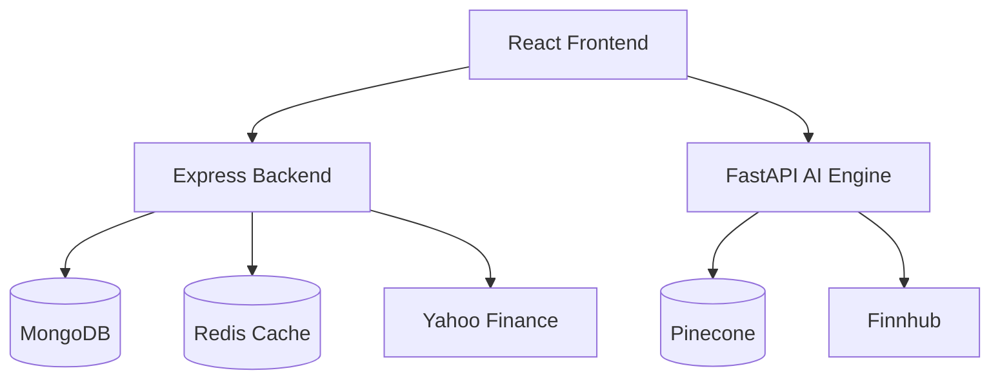

# Tradeverse AI

Tradeverse AI is a full-stack simulated trading platform. It lets users manage a virtual wallet, buy and sell equities in a paper portfolio, view live market prices, and run an experimental decision engine that combines news sentiment, vector search, and technical indicators.

The project is intended as a trading education and engineering showcase. It does not execute real trades and does not predict the future.

## Architecture

The application is split into three services:

1. **Frontend**: React, Vite, Tailwind CSS, React Router, Axios, and Lucide React.
2. **Backend**: Node.js, Express, MongoDB, Mongoose, JWT cookies, Redis price caching, and Yahoo Finance market data.
3. **AI Engine**: Python, FastAPI, Pinecone, Sentence Transformers, FinBERT, Finnhub news, RSI, moving averages, volatility filters, and market-regime heuristics.



## Key Features

- HttpOnly-cookie authentication with access and refresh tokens
- Virtual wallet and paper-trading portfolio
- Buy and sell order execution with MongoDB transactions
- Weighted average price calculation for repeated buys
- Trade history and portfolio endpoints
- Redis-backed live price caching
- Trading dashboard with chart, holdings, bot controls, and execution log
- AI signal endpoint combining sentiment and technical indicators
- Backend controller tests for core trade behavior

## Repository Layout

```text
Tradeverse-Frontend/   React dashboard
Tradeverse-Backend/    Express API and MongoDB models
Tradeverse-AI/         FastAPI decision engine and market-news scripts
docker-compose.yml     Redis-only local helper
```

## Environment Variables

Create `.env` files from the provided examples:

- `Tradeverse-Frontend/.env.example`
- `Tradeverse-Backend/.env.example`
- `Tradeverse-AI/.env.example`

Important values include:

- `VITE_API_URL`
- `VITE_AI_URL`
- `MONGODB_URI`
- `ACCESS_TOKEN_SECRET`
- `REFRESH_TOKEN_SECRET`
- `REDIS_URL`
- `PINECONE_API_KEY`
- `FINNHUB_API_KEY`
- Cloudinary avatar-upload keys

## Local Setup

Install dependencies in each service:

```bash
cd Tradeverse-Backend
npm install

cd ../Tradeverse-Frontend
npm install

cd ../Tradeverse-AI
pip install -r requirements.txt
```

Start Redis if you want price caching:

```bash
docker-compose up -d
```

This compose file intentionally starts Redis only. Full multi-service Docker orchestration is not included because the project is currently optimized for local development on limited disk space.

Run the services:

```bash
cd Tradeverse-Backend
npm run dev
```

```bash
cd Tradeverse-Frontend
npm run dev
```

```bash
cd Tradeverse-AI
uvicorn main:app --host 0.0.0.0 --port 8001
```

## API Overview

### Auth and User

- `POST /api/v1/users/register`
- `POST /api/v1/users/login`
- `POST /api/v1/users/logout`
- `POST /api/v1/users/refresh-token`
- `POST /api/v1/users/wallet/add`
- `GET /api/v1/users/balance`

### Trading

- `GET /api/v1/trades/price/:symbol`
- `POST /api/v1/trades/buy`
- `POST /api/v1/trades/sell`
- `GET /api/v1/trades/portfolio`
- `GET /api/v1/trades/history`

### AI

- `POST /api/v1/ai/ask`
- `POST /api/predict` on the FastAPI service
- `POST /search` on the FastAPI service

## AI Strategy

The AI engine is a heuristic decision system, not a guaranteed market predictor. It combines:

- FinBERT sentiment from recent market headlines
- Pinecone vector search for relevant news memory
- RSI and moving-average signals
- Volatility guardrails
- Market-regime weighting
- A bounded Kelly-style risk allocation value

The output should be treated as a paper-trading signal for experimentation.

## Backtesting

The repository includes `Tradeverse-AI/colab_backtester.py` as a backtesting experiment. Use it to reproduce and update performance claims before adding any specific return or drawdown numbers to a resume.

Current limitation: the backtest is educational and should be reviewed for assumptions such as transaction costs, slippage, lookahead bias, and survivorship bias before presenting results as rigorous.

## Tests

Backend:

```bash
cd Tradeverse-Backend
npm test
```

Frontend:

```bash
cd Tradeverse-Frontend
npm run lint
npm test
npm run build
```

## Known Limitations

- Full Docker orchestration is intentionally omitted to save local disk space.
- The AI service depends on external APIs and model downloads.
- MongoDB transactions require a deployment that supports transactions.
- The app is a simulator and is not connected to a real broker.
- Demo data is not seeded automatically yet.

## Future Improvements

- Add a seed script for demo users and sample portfolios
- Add integration tests around auth and wallet flows
- Add full Docker Compose or a cloud deployment recipe
- Add broker-sandbox integration, such as Alpaca paper trading
- Improve backtesting rigor and publish reproducible results
